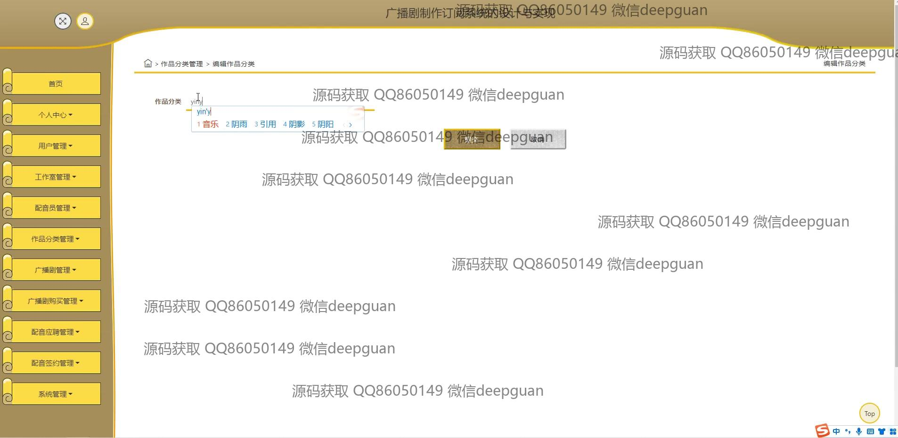

<h1 align="center">广播剧制作订阅系统的设计与实现</h1>

## 简介
广播剧制作订阅系统：提供登录注册、用户管理、作品展示、购买管理、配音签约、搜索查询等功能，适应用户与配音员的多角色需求，界面简洁，操作便捷。    --计算机毕业设计源码；毕设源码；java毕业设计源码

## 联系方式

<h3 align="center">获取完整代码与数据库文件 + 微信：deepguan QQ: 86050149 QQ群: 783742310</h3>

<h3 align="center">可帮忙远程部署 包运行成功！提供远程部署、修改代码、设计文档指导、代码讲解等服务！</h3>

## 功能介绍（完整见运行截图）
管理员：可以访问系统的各个管理模块，包括广播剧管理、用户管理、作品分类管理以及配音签约管理等。管理员可以执行查看、添加、修改、删除等操作来维护广播剧信息和管理用户账户。登录界面包括用户名、密码和身份类型选择，支持管理员角色的身份验证与功能授权。

用户：用户可以注册、登录，并访问个人中心管理个人资料。他们可以浏览广播剧列表，根据分类查看详情，并进行搜索。用户可用功能包括广播剧购买和管理、收藏广播剧、查看广播剧详细信息如分类、剧集和简介，以及执行购买和收藏操作。

配音员：配音员可以通过注册功能创建账户，并访问个人中心查看和管理个人资料。系统允许配音员查看和应聘广播剧项目，进行签约管理。配音员可以通过搜索功能查找特定剧目，并下载合同相关文件。注册界面支持上传个人头像，以完善个人资料。

工作室：工作室角色支持注册和登录，管理与广播剧制作相关的各项事务。工作室可以添加和编辑广播剧的信息，包括剧目编号、内容简介、发布时间等。工作室也负责管理与配音员相关的招聘和签约事务，并可使用系统导航功能高效管理各项内容。

## 运行截图

本代码来源于网络,仅供学习参考使用!

